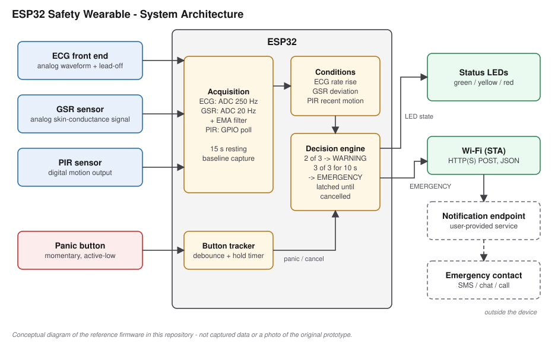
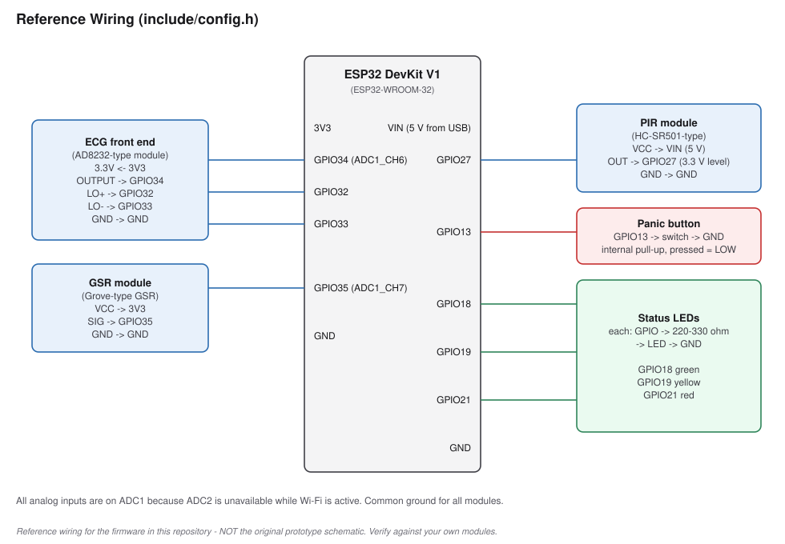
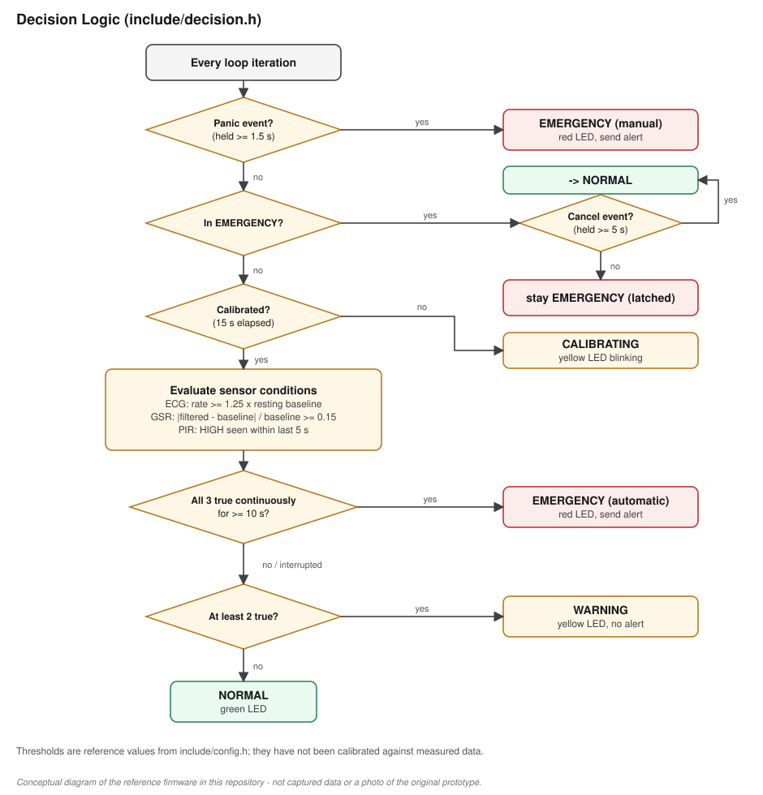
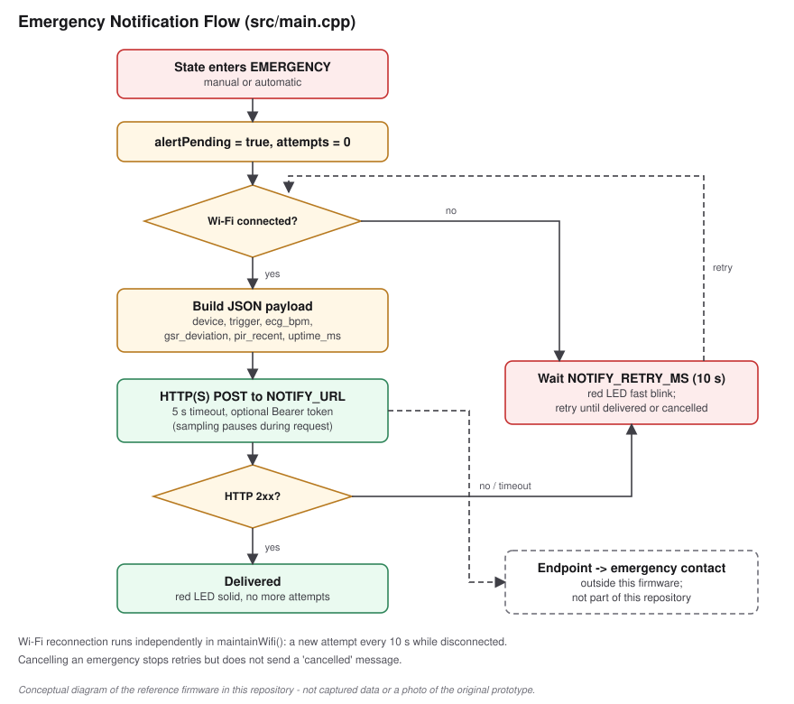
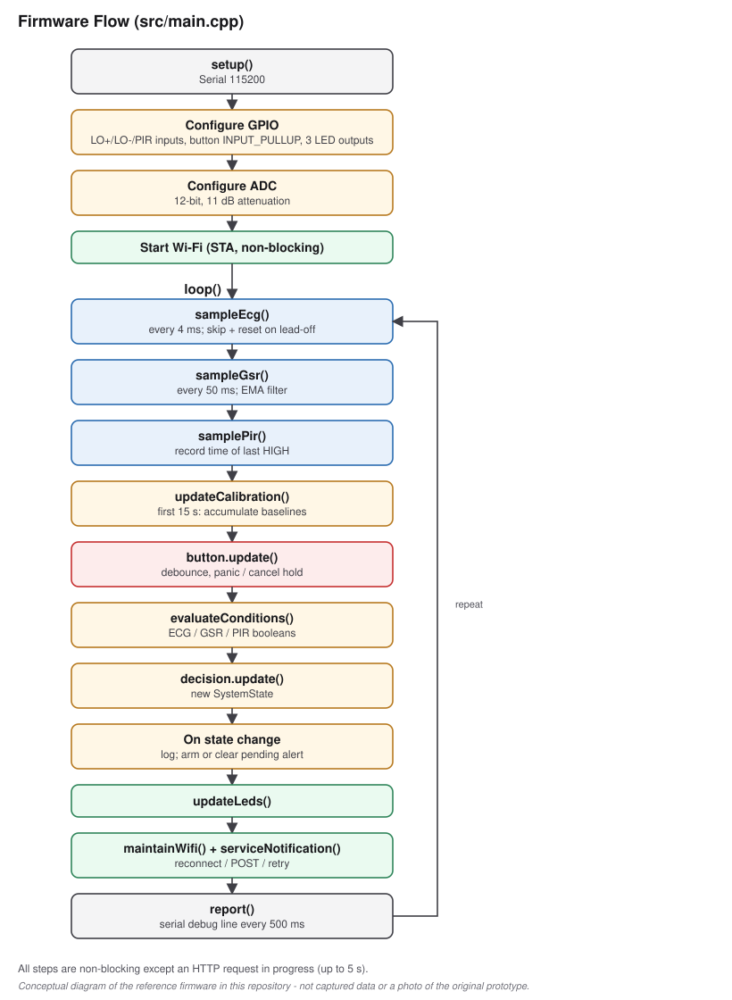

# ESP32 Safety Wearable

**Multi-sensor ESP32 wearable with ECG, GSR, PIR, panic-button input, event detection, LED indication, and emergency notification**

> 🏆 **First Prize — HerZion Ideathon 2025**

An ESP32-based wearable safety prototype that combines **ECG**, **GSR** and
**PIR** sensing with **rule-based event detection**, a **manual panic
trigger**, local **LED indication**, and **emergency-contact notification**.



> **About this repository.** The original competition firmware, schematics and
> test records were not committed here. The architecture above is the
> confirmed design. The firmware in [`src/`](src) and [`include/`](include) is
> a **reference implementation** of that design, written to document it in
> working, testable code. Specific module types, pins, thresholds and the
> notification transport belong to this reference implementation, not to a
> recovered copy of the original prototype. See
> [docs/overview.md](docs/overview.md).

> **Scope.** This is a prototype embedded safety system. It is **not** a
> certified emergency-response device or a medical/diagnostic device, and it
> does not guarantee that an emergency will be detected.

---

## Key Specifications

| Component | Implementation | Status |
|---|---|---|
| MCU | ESP32 (reference board: DevKit V1 / ESP32-WROOM-32) | ESP32 confirmed; board is reference |
| ECG sensing | Single-lead analog front end (AD8232-type), ADC1, 250 Hz, lead-off detection | ECG confirmed; module/processing reference |
| GSR sensing | Analog GSR module (Grove-type), ADC1, 20 Hz, EMA filter | GSR confirmed; module/processing reference |
| Motion / presence sensing | PIR (HC-SR501-type), digital input | PIR confirmed; module reference |
| Manual emergency input | Panic button, 1.5 s hold, 50 ms debounce | Button confirmed; timing reference |
| Local indication | 3 LEDs (green / yellow / red) | LEDs confirmed; mapping reference |
| Decision logic | Rule-based: 2-of-3 → warning, 3-of-3 sustained 10 s → emergency, panic overrides | Rule-based logic confirmed; rules reference |
| Notification | Wi-Fi + HTTP(S) JSON POST to a user-provided endpoint | Contact notification confirmed; transport reference |
| Framework | Arduino on ESP32, PlatformIO | Reference |

## Recognition

🏆 **First Prize — HerZion Ideathon 2025**

Project: ESP32 wearable safety watch integrating ECG, GSR, and PIR sensing.
The prototype was the winning entry at the ideathon.

---

## Project Overview

The wearable watches three inputs: a body signal (ECG), a skin-conductance
signal (GSR) and the surroundings (PIR motion). It reduces each to a simple
condition and flags a situation only when the conditions **agree** and
**persist**. Separately, the wearer can raise an emergency at any time by
holding the panic button. Either path lights the red LED and sends an alert
that a backend forwards to an emergency contact.

```
        ECG ─┐
        GSR ─┼─► ESP32 ─► Decision logic ─┬─► LEDs
        PIR ─┘     ▲                      └─► Emergency ─► Notification ─► Contact
                   │
      Panic button ┘  (manual trigger, overrides the sensor rules)
```

More detail: [docs/overview.md](docs/overview.md)

## System Architecture

The ESP32 runs a single cooperative loop that samples the sensors, evaluates
the rules, drives the LEDs and handles the network. The panic button bypasses
the sensor rules. The device sends alerts to one HTTP(S) endpoint and stores
no contact details itself.

→ [docs/system-architecture.md](docs/system-architecture.md)

## Hardware Architecture



| Function | ESP32 pin (reference) |
|---|---|
| ECG output | GPIO34 (ADC1_CH6) |
| ECG lead-off LO+ / LO− | GPIO32 / GPIO33 |
| GSR output | GPIO35 (ADC1_CH7) |
| PIR output | GPIO27 |
| Panic button | GPIO13 (internal pull-up, active-low) |
| LED green / yellow / red | GPIO18 / GPIO19 / GPIO21 |

The analog sensors use ADC1 because ADC2 is unavailable while Wi-Fi is
active, and boot-strapping pins are avoided. →
[docs/pinout.md](docs/pinout.md)

## Sensor Interfaces

| Sensor | Interface | ESP32 pin | Signal type | Role |
|---|---|---|---|---|
| ECG | Analog + 2 digital lead-off | GPIO34, GPIO32/33 | Single-lead waveform | Beat-interval rate vs. resting baseline |
| GSR | Analog | GPIO35 | Conductance-related voltage | Deviation from resting baseline |
| PIR | Digital | GPIO27 | HIGH = motion | Recent motion near the wearer |
| Panic button | Digital, pull-up | GPIO13 | LOW = pressed | Manual emergency trigger |

→ [docs/sensor-interface.md](docs/sensor-interface.md)

## ECG Acquisition

The ECG is sampled at 250 Hz on ADC1. Samples are discarded whenever the
AD8232 lead-off lines report a detached electrode. An adaptive threshold
(60 % of the previous 2 s window's range) with a 300 ms refractory period
detects dominant peaks, and the mean of the last four intervals gives a rough
rate. The ECG **condition** is true when that rate is ≥ 1.25× the wearer's
resting baseline from the 15 s calibration. There is no waveform
classification, arrhythmia detection or clinical heart-rate claim.

→ [docs/ecg.md](docs/ecg.md)

## GSR Acquisition

The GSR is sampled at 20 Hz and smoothed with an exponential moving average
(α = 0.10). The condition is true when the reading deviates ≥ 15 % from the
resting baseline. It is treated as a **conductance response**, not as a
measurement of stress or emotion. If no contact is detected at boot, the
condition is disabled.

→ [docs/gsr.md](docs/gsr.md)

## PIR Detection

The PIR is a digital input where HIGH means motion. The condition stays true
for 5 s after the last HIGH, so a short pulse can overlap with the slower
physiological conditions. It reports motion only, not identity or intent,
and on a moving wearer it can trigger from the wearer's own movement.

→ [docs/pir.md](docs/pir.md)

## Panic Button


GPIO13 with an internal pull-up and 50 ms debounce. Holding for **1.5 s**
raises an emergency at once, even during calibration. A new press held for
**5 s** during an emergency cancels it. One press produces at most one event.

→ [docs/panic-button.md](docs/panic-button.md)

## Decision Logic



| Rule | Result |
|---|---|
| Panic button held ≥ 1.5 s | **EMERGENCY** (manual), from any state |
| All 3 conditions true continuously ≥ 10 s | **EMERGENCY** (automatic) |
| ≥ 2 conditions true | **WARNING** (LED only, no alert) |
| Otherwise | **NORMAL** |
| In EMERGENCY | Latched until a 5 s cancel hold |

This is a plain rule-based state machine with no machine learning. Every
threshold is a configured reference value in
[`include/config.h`](include/config.h), not a value derived from data.

→ [docs/decision-logic.md](docs/decision-logic.md)

## LED Indication

| State | LED |
|---|---|
| Calibrating (first 15 s) | Yellow blinking |
| Normal (Wi-Fi up / down) | Green solid / green blinking |
| Warning | Yellow solid |
| Emergency (sending / delivered) | Red fast blink / red solid |

→ [docs/indication.md](docs/indication.md)

## Emergency Notification



When the device enters EMERGENCY, it POSTs a JSON alert to `NOTIFY_URL` over
Wi-Fi (5 s timeout, optional bearer token, optional CA pinning). It retries
every 10 s until it gets an HTTP 2xx or the user cancels. The receiving
service forwards the alert to the emergency contact. Credentials live in a
git-ignored `include/secrets.h`; the repository contains placeholders only.

→ [docs/notification.md](docs/notification.md)

## Firmware Flow



`setup()` configures GPIO, the ADC and Wi-Fi. `loop()` then samples, decides,
indicates and notifies in non-blocking, time-sliced steps. The decision,
button and ECG logic live in Arduino-independent headers so they can be unit
tested on a PC.

→ [docs/firmware-flow.md](docs/firmware-flow.md) ·
[docs/sensor-acquisition.md](docs/sensor-acquisition.md)

## Testing

| Area | Status |
|---|---|
| Decision rules, button logic, ECG estimator | **Passed**: host unit tests with synthetic inputs (`tests/test_logic.cpp`) |
| ESP32 cross-compile | Not run in the authoring environment (toolchain download blocked); run `pio run` locally |
| Sensors, LEDs, notification on hardware | Implemented; no recorded hardware test results |

→ [docs/testing.md](docs/testing.md)

## Debugging

The firmware prints a status line every 500 ms with every intermediate value
(lead-off state, ECG range and rate, GSR deviation, conditions, Wi-Fi), along
with state-transition and alert logs. The design includes guards against known
failure modes such as contact bounce, detached electrodes, ADC2/Wi-Fi
conflicts and boot-strapping pins.

→ [docs/debugging.md](docs/debugging.md)

## Results / Observed Behavior

- **Recognised:** First Prize, HerZion Ideathon 2025.
- **Implemented:** the complete reference firmware described above.
- **Tested:** the logic modules, by host unit tests on synthetic inputs.
- **Observed:** no prototype observations are recorded in this repository.
- **Not quantified:** detection accuracy, false-positive and false-negative
  rates, rate accuracy, latency, battery life.

→ [docs/results.md](docs/results.md)

## Limitations

- Threshold-based, single-boot calibration; not medical-grade; untuned thresholds
- Signal quality depends on electrode contact, placement and movement
- PIR responds to the wearer's own motion
- Notification needs Wi-Fi; no cellular fallback, no GPS location
- No power management, enclosure design or certification
- False positives and negatives are possible and unmeasured

→ [docs/limitations.md](docs/limitations.md)

## Future Work

*Not implemented; possible next steps:*

- Recover and commit the original prototype firmware and wiring
- Record labelled sensor data and tune thresholds from it
- Personalised and adaptive thresholds, baseline tracking, event confidence scoring
- Better ECG filtering (digital band-pass) and motion-artefact rejection
- Local data storage for post-event review
- Battery monitoring, deep-sleep power optimisation
- Vibration / haptic feedback to confirm a panic press discreetly
- GPS location in alerts; cellular (GSM/LTE) or phone-BLE backup path
- Certificate-verified TLS by default; signed or authenticated notification service; "cancelled" follow-up message
- Watchdog-based recovery
- Enclosure and wearable ergonomics
- Controlled user studies and quantitative false-positive / false-negative evaluation

## Reproduction

```bash
cp include/secrets.example.h include/secrets.h   # fill in placeholders
pio run                  # build
pio run -t upload        # flash
pio device monitor       # 115200 baud

# host-side logic tests
g++ -std=c++17 -Wall -Wextra -Iinclude tests/test_logic.cpp -o tests/test_logic && ./tests/test_logic
```

→ [docs/reproduction.md](docs/reproduction.md)

## Technical Learnings

- **ESP32 firmware development:** Arduino framework, PlatformIO, a cooperative
  non-blocking main loop
- **Multi-sensor interfacing:** two analog channels and three digital inputs
  on one MCU
- **Analog acquisition:** ADC resolution and attenuation, ADC1 vs. ADC2 under
  Wi-Fi, relative rather than absolute measures
- **Signal handling:** lead-off gating, adaptive peak thresholds, refractory
  periods, EMA filtering, baseline calibration
- **GPIO handling:** pull-ups, active-low inputs, input-only pins, avoiding
  strapping pins
- **Event detection:** threshold-based conditions, multi-condition agreement,
  time-sustained confirmation, latched states
- **User-input handling:** debouncing, hold-to-trigger, state-aware cancel
- **Status indication:** unambiguous single-LED state encoding
- **Wireless communication:** Wi-Fi station management, HTTP(S) POST,
  timeouts, retries, TLS trade-offs
- **Embedded debugging:** structured serial telemetry, separating pure logic
  for host-side testing
- **Hardware-software integration:** keeping firmware design honest about
  sensor limitations

## Repository Structure

```
esp32-safety-wearable-/
├── README.md
├── platformio.ini
├── src/main.cpp                 # setup/loop, sampling, LEDs, Wi-Fi, alerts
├── include/
│   ├── config.h                 # pins, timings, thresholds
│   ├── decision.h               # rule-based state machine
│   ├── button.h                 # debounce + hold logic
│   ├── ecg_rate.h               # beat-interval estimator
│   └── secrets.example.h        # credential placeholders
├── tests/                       # host-side unit tests
├── data/                        # (empty) place for recorded data
├── docs/                        # design documentation
└── assets/                      # SVG diagrams (conceptual, not data)
```
