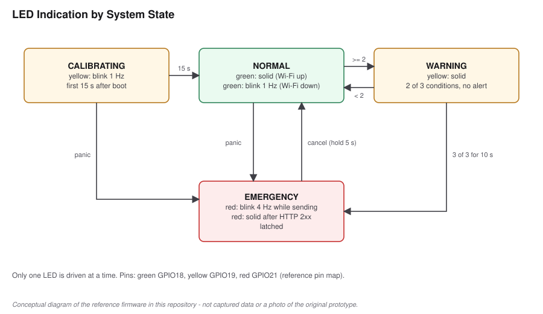

# LED Indication

> **Provenance:** LED indication is a **confirmed** feature. The number of
> LEDs, their pins and their meanings describe the **reference
> implementation** (`updateLeds()` in [`src/main.cpp`](../src/main.cpp)).

## Hardware

| LED | GPIO | Drive |
|---|---|---|
| Green | GPIO18 | Active-high, 220–330 Ω series resistor to GND |
| Yellow | GPIO19 | Active-high, 220–330 Ω series resistor to GND |
| Red | GPIO21 | Active-high, 220–330 Ω series resistor to GND |

At most one LED is lit at a time, so each state has an unambiguous pattern.

## Meaning

| State | LED pattern | What it tells the wearer |
|---|---|---|
| CALIBRATING | Yellow blinking, 1 Hz | Keep still; baselines are being captured (first 15 s) |
| NORMAL, Wi-Fi connected | Green solid | Armed; an alert could be sent |
| NORMAL, Wi-Fi not connected | Green blinking, 1 Hz | Armed, but an alert could not be delivered right now |
| WARNING | Yellow solid | Two sensor conditions are true; no alert sent |
| EMERGENCY, alert not yet delivered | Red blinking, 4 Hz | Emergency raised; sending or retrying |
| EMERGENCY, alert delivered | Red solid | Endpoint acknowledged with HTTP 2xx |

"Delivered" means the configured endpoint returned a 2xx status. It does
**not** confirm that a person received or read the message.

## Reset

A 5 s cancel hold returns the device from EMERGENCY to NORMAL, and the LED
changes from red to green on the next loop iteration. There is no other reset
path apart from power-cycling, which also restarts calibration.

## Implementation note

The blink phases come from `millis()` (`(now / 500) % 2` for 1 Hz,
`(now / 125) % 2` for 4 Hz), so blinking needs no extra timers or state.
During a blocking HTTP request the LEDs freeze for up to 5 s.
