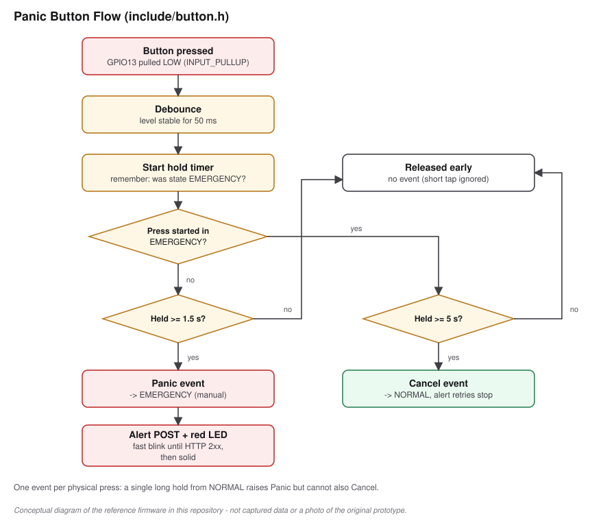

# Panic Button

> **Provenance:** A panic-button input is a **confirmed** part of the
> prototype. Pin, timings and cancel behaviour describe the **reference
> implementation** ([`include/button.h`](../include/button.h)).

## Role

The panic button is the **explicit, manual emergency trigger**. It does not
depend on any sensor reading, baseline or threshold, and it works during the
calibration period. It is the most reliable way to raise an alert in this
design. The automatic sensor rule is a secondary path.

## Electrical

| Item | Value |
|---|---|
| Pin | GPIO13 |
| Wiring | Momentary switch between GPIO13 and GND |
| Bias | Internal pull-up (`INPUT_PULLUP`), no external resistor |
| Pressed level | LOW |

## Debounce

A mechanical switch bounces for a few milliseconds when pressed or released.
`ButtonTracker` accepts a new level only after the raw reading has stayed the
same for **50 ms** (`BUTTON_DEBOUNCE_MS`). The unit test feeds a 10 ms
on/off toggle for 1 s and checks that no press is registered.

## Press behaviour

| Situation when the press **starts** | Hold time | Event | Result |
|---|---:|---|---|
| Not in EMERGENCY | < 1.5 s | none | Short taps are ignored, to avoid accidental alerts |
| Not in EMERGENCY | ≥ 1.5 s (`PANIC_HOLD_MS`) | `Panic` | EMERGENCY (manual); alert is sent |
| In EMERGENCY | < 5 s | none | Stays in EMERGENCY |
| In EMERGENCY | ≥ 5 s (`CANCEL_HOLD_MS`) | `Cancel` | Back to NORMAL; alert retries stop |

The tracker records **which state the press started in**, and it fires at
most one event per press. As a result, one long hold from NORMAL raises an
emergency but cannot go on to cancel it. A deliberate new press is needed to
cancel. The unit test covers this case.

Both events fire while the button is still held, at the moment the threshold
is reached. The user does not have to release the button.

## Cancel behaviour

Cancelling returns the device to NORMAL and stops further notification
attempts. No "cancelled" message is sent to the contact. If an alert was
already delivered, the contact is not told that it was withdrawn. This is
listed in [limitations.md](limitations.md).
